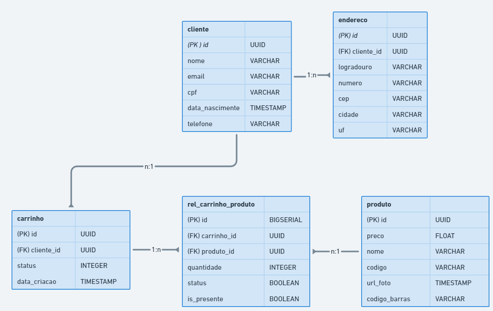

# Atividade Modelagem de Banco de Dados

> **Problema:** Modele um sistema que tenha clientes, em que cada cliente possa ter vários endereços, vários carrinhos de compras. O carrinho deve ter status *"aberto, fechado, finalizado"*. O carrinho também deve ter vários produtos.

**Resposta:**
A Figura 01 mostra o **diagrama entidade relacionamento (ER)** para o problema em questão.

    

    <em> Figura 01: Diagrama ER para o sistema de compras.

No diagrama foram utilizadas as abreviações **PK** e **FK** para **Primary Key (Chave Primária)** e **Foreing Key (Chave Estrangeira)** respectivamente.

O diagrama também pode ser acessado na plataforma Whimsical através deste [link](https://whimsical.com/sistema-de-compras-CfG5q16prNZgYwrZtHJ2ra).